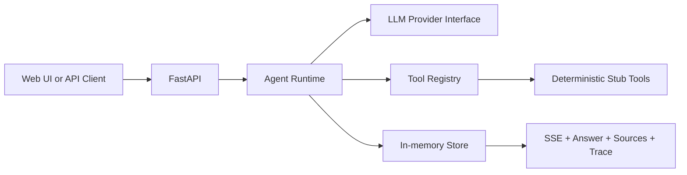

# Enterprise Research Agent

A lightweight, traceable research-agent skeleton based on the [PRD](https://app.notion.com/p/3c897d4ad24781f698eefce7533cc444). The current release finishes the main product loop while deliberately keeping every external capability deterministic and offline.

> Demo boundary: RAG, Web Search, HTTP, SQL, Python, Browser, and MCP tools return fixed placeholder content. No live website, database, browser, code sandbox, vector store, or third-party service is accessed.

## What works

- FastAPI chat API and POST-based SSE streaming
- Lightweight agent loop with max steps, total timeout, tool timeout, and repeated-call protection
- Parallel independent tool calls with a concurrency limit
- Unified tool registry, JSON schemas, permissions, results, and error boundaries
- Replaceable LLM provider interface: deterministic offline planner or OpenAI Responses API
- Eight placeholder tools: knowledge, web, HTTP, schema, SQL, Python, browser, and MCP
- In-memory conversations and run records
- Source citations, explainable execution trace, run latency, decision count, and tool-call count
- Responsive three-panel interface for conversations, chat, sources, and trace
- Docker Compose and automated runtime/API/contract tests

## Architecture



The deterministic provider still exercises the real runtime behavior. Discovery tools run in parallel, schema discovery gates read-only SQL, SQL results gate Python analysis, and browser is only selected for explicit interactive intent.

## LLM provider modes

The default remains `LLM_PROVIDER=deterministic`, so the application runs without a key and every
external tool remains a fixed-response demo stub.

To enable the OpenAI provider, set these environment variables locally (never commit the key):

```bash
LLM_PROVIDER=openai
OPENAI_API_KEY=your_api_key
OPENAI_MODEL=gpt-5-mini
# Optional: OPENAI_BASE_URL=https://api.openai.com/v1
```

The provider uses the [Responses API](https://developers.openai.com/api/reference/cli/resources/responses/methods/create)
with the registry's JSON schemas as function tools. It preserves the model-issued `call_id`, returns
tool results as `function_call_output` items with `previous_response_id`, permits parallel tool calls,
and records input/output token totals in each run. This follows OpenAI's
[function-calling guide](https://developers.openai.com/api/docs/guides/function-calling).

The application fails fast if `LLM_PROVIDER=openai` is selected without `OPENAI_API_KEY`; it does not
silently fall back to deterministic answers.

## Run locally

Python 3.12 or 3.13 is recommended. Python 3.14 may not yet be supported by every pinned dependency.

```bash
python -m venv .venv
# PowerShell: .venv\Scripts\Activate.ps1
# macOS/Linux: source .venv/bin/activate
pip install -e ".[dev]"
uvicorn app.main:app --reload
```

Open <http://localhost:8000>. API docs are available at <http://localhost:8000/docs>.

To use Docker:

```bash
docker compose up --build
```

## API

| Method | Path | Purpose |
|---|---|---|
| `GET` | `/api/health` | Health and demo-mode status |
| `GET` | `/api/tools` | Tool catalog and JSON schemas |
| `POST` | `/api/chat` | Run synchronously and return a complete run |
| `POST` | `/api/chat/stream` | Stream ordered SSE events |
| `GET` | `/api/conversations` | List in-memory conversations |
| `GET` | `/api/conversations/{id}` | Read one conversation |
| `GET` | `/api/runs/{id}` | Read a traceable run |

Example:

```bash
curl -N -X POST http://localhost:8000/api/chat/stream \
  -H "Content-Type: application/json" \
  -d '{"query":"调研市场并结合采购数据做分析"}'
```

Events are sequenced and include `run_started`, `agent_decision`, `tool_started`, `tool_completed`, `assistant_delta`, and `run_completed` (or `run_failed`). The trace intentionally records decision summaries, not hidden chain-of-thought.

## Test

```bash
pytest
ruff check .
```

## Safety and current limitations

- SQL validates that a request begins with `SELECT`, even in demo mode.
- Python is never executed; the Python tool returns a fixed result.
- HTTP and browser tools never make network requests.
- High-risk browser behavior is labeled `high` permission but has no approval workflow yet.
- The OpenAI API key is read only from configuration and is never included in API responses, traces, or logs.
- State is process-local and disappears on restart.
- Authentication, tenant isolation, durable audit logs, and production rate limiting are not implemented.

## Replacement path

Each real integration should implement the existing `BaseTool` contract and be registered without changing the agent runtime or API event protocol. Recommended order:

1. Real LLM provider and native tool calling.
2. Qdrant-backed document ingestion and retrieval with source spans.
3. Web Search and hardened HTTP fetch/parser.
4. Schema retrieval, SQL AST validation, read-only PostgreSQL, timeout, and row limit.
5. Isolated Python worker and Playwright browser worker.
6. MCP discovery/invocation and permissions.
7. PostgreSQL/Redis persistence, auth, budget controls, and evaluation.
