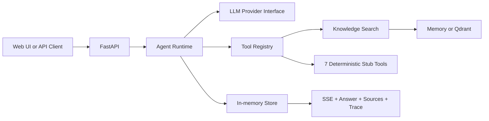

# Enterprise Research Agent

A lightweight, traceable research agent based on the [PRD](https://app.notion.com/p/3c897d4ad24781f698eefce7533cc444). The current release includes controlled knowledge ingestion and retrieval while keeping the remaining external capabilities deterministic and offline.

> Demo boundary: Knowledge Search is real by default. Web Search and HTTP Fetch can be explicitly enabled with server-side configuration; SQL, Python, Browser, and MCP remain fixed placeholder tools. The local deterministic embedding is intended for development, not production semantic quality.

## What works

- FastAPI chat API and POST-based SSE streaming
- Lightweight agent loop with max steps, total timeout, tool timeout, and repeated-call protection
- Parallel independent tool calls with a concurrency limit
- Unified tool registry, JSON schemas, permissions, results, and error boundaries
- Replaceable LLM provider interface: deterministic offline planner or OpenAI Responses API
- Real text ingestion, deterministic chunking, authorization filtering, and anchored citations
- Optional Qdrant vector storage; seven remaining placeholder tools
- In-memory conversations and run records
- Source citations, explainable execution trace, run latency, decision count, and tool-call count
- Responsive three-panel interface for conversations, chat, sources, and trace
- Docker Compose and automated runtime/API/contract tests

## Architecture



The deterministic provider still exercises the real runtime behavior. Discovery tools run in parallel, schema discovery gates read-only SQL, SQL results gate Python analysis, and browser is only selected for explicit interactive intent.

## LLM provider modes

The default remains `LLM_PROVIDER=deterministic`, so the application runs without a key and every
external tool remains a fixed-response demo stub.

To enable the OpenAI provider, set these environment variables locally (never commit the key):

```bash
LLM_PROVIDER=openai
OPENAI_API_KEY=your_api_key
OPENAI_MODEL=gpt-5-mini
# Optional: OPENAI_BASE_URL=https://api.openai.com/v1
```

The provider uses the [Responses API](https://developers.openai.com/api/reference/cli/resources/responses/methods/create)
with the registry's JSON schemas as function tools. It preserves the model-issued `call_id`, returns
tool results as `function_call_output` items with `previous_response_id`, permits parallel tool calls,
and records input/output token totals in each run. This follows OpenAI's
[function-calling guide](https://developers.openai.com/api/docs/guides/function-calling).

The application fails fast if `LLM_PROVIDER=openai` is selected without `OPENAI_API_KEY`; it does not
silently fall back to deterministic answers.

## Run locally

Python 3.12 or 3.13 is recommended. Python 3.14 may not yet be supported by every pinned dependency.

```bash
python -m venv .venv
# PowerShell: .venv\Scripts\Activate.ps1
# macOS/Linux: source .venv/bin/activate
pip install -e ".[dev]"
uvicorn app.main:app --reload
```

The default `KNOWLEDGE_BACKEND=memory` needs no external service. To use Qdrant, configure:

```bash
KNOWLEDGE_BACKEND=qdrant
QDRANT_URL=http://localhost:6333
QDRANT_API_KEY=your_qdrant_api_key
KNOWLEDGE_ADMIN_TOKEN=a_long_random_admin_token
```

Open <http://localhost:8000>. API docs are available at <http://localhost:8000/docs>.

Docker Compose starts the agent and Qdrant with named-volume persistence. Its fallback secrets are for localhost development only; set both variables before exposing or sharing the stack:

```bash
KNOWLEDGE_ADMIN_TOKEN=replace-me QDRANT_API_KEY=replace-me docker compose up --build
```

### Controlled knowledge ingestion

Ingestion is disabled unless `KNOWLEDGE_ADMIN_TOKEN` is configured:


```bash
curl -X POST http://localhost:8000/api/knowledge/documents \
  -H "Content-Type: application/json" \
  -H "X-Knowledge-Admin-Token: $KNOWLEDGE_ADMIN_TOKEN" \
  -H "X-Tenant-Id: demo" \
  -H "X-Principal-Ids: demo-user" \
  -d '{"title":"Supplier policy","content":"Quarterly review is required.","knowledge_base_id":"policy","allowed_principal_ids":["demo-user"]}'
```

`X-Tenant-Id` and `X-Principal-Ids` are ignored by default. Set `KNOWLEDGE_TRUST_ACCESS_HEADERS=true` only behind an authenticated gateway that removes caller-supplied versions and injects verified identity. This project does not yet implement authentication or a tenant directory.

Knowledge citations include `document_id`, `chunk_id`, `knowledge_base_id`, `char_start`, `char_end`, score, and the exact snippet. Character spans index the original submitted text.

To start the local stack with development defaults:

```bash
docker compose up --build
```

## API

| Method | Path | Purpose |
|---|---|---|
| `GET` | `/api/health` | Health and demo-mode status |
| `GET` | `/api/tools` | Tool catalog and JSON schemas |
| `POST` | `/api/knowledge/documents` | Admin-token protected text ingestion |
| `POST` | `/api/chat` | Run synchronously and return a complete run |
| `POST` | `/api/chat/stream` | Stream ordered SSE events |
| `GET` | `/api/conversations` | List in-memory conversations |
| `GET` | `/api/conversations/{id}` | Read one conversation |
| `GET` | `/api/runs/{id}` | Read a traceable run |

Example:
### Public Web Search and safe HTTP Fetch

Both capabilities remain `stub` by default, so local development and offline tests do not make network requests. To enable Brave Search, obtain a server-side subscription token and set:

```bash
WEB_SEARCH_BACKEND=brave
BRAVE_SEARCH_API_KEY=your_brave_subscription_token
```

The provider calls Brave's Web Search endpoint with the token in `X-Subscription-Token`; the tool schema, trace, API response, and citations never contain that secret. Brave documents this endpoint and header in its [Web Search API reference](https://api-dashboard.search.brave.com/api-reference/web/search/get) and [authentication guide](https://api-dashboard.search.brave.com/documentation/guides/authentication).

HTTP Fetch is separately enabled and requires an explicit allowlist. Use only domains controlled or approved by your organization:

```bash
HTTP_FETCH_BACKEND=safe
HTTP_ALLOWED_HOSTS=www.example.com,.approved.example
HTTP_FETCH_MAX_BYTES=1000000
HTTP_FETCH_MAX_REDIRECTS=3
```

The fetcher permits HTTPS by default, rejects URL credentials and IP literals, requires every resolved address to be public, validates every redirect target again, accepts only HTML/plain text/JSON, and stops reading after the configured byte limit. `HTTP_FETCH_ALLOW_HTTP=true` is only for narrowly controlled development endpoints and should not be used in production. This is a defense-in-depth application control; production deployment should additionally enforce outbound egress rules and DNS protections at the network layer.

```bash
curl -N -X POST http://localhost:8000/api/chat/stream \
  -H "Content-Type: application/json" \
  -d '{"query":"调研市场并结合采购数据做分析"}'
```

Events are sequenced and include `run_started`, `agent_decision`, `tool_started`, `tool_completed`, `assistant_delta`, and `run_completed` (or `run_failed`). The trace intentionally records decision summaries, not hidden chain-of-thought.

## Test

```bash
pytest
ruff check .
```

## Safety and current limitations

- Knowledge filters are generated server-side from an `AccessContext`, never from LLM tool arguments.
- Access headers are disabled by default and are only a trusted-gateway integration seam, not authentication.
- Ingestion requires a separate admin token and is disabled when the token is absent.
- The deterministic local embedding supports offline tests but is not a substitute for a production embedding model.
- Qdrant should use API-key/TLS controls and private networking outside local development.
- SQL validates that a request begins with `SELECT`, even in demo mode.
- Python is never executed; the Python tool returns a fixed result.
- HTTP and browser tools never make network requests.
- High-risk browser behavior is labeled `high` permission but has no approval workflow yet.
- The OpenAI API key is read only from configuration and is never included in API responses, traces, or logs.
- State is process-local and disappears on restart.
- Authentication, tenant provisioning, durable audit logs, and production rate limiting are not implemented.

## Replacement path

Each real integration should implement the existing `BaseTool` contract and be registered without changing the agent runtime or API event protocol. Recommended order:

1. Real LLM provider and native tool calling.
2. Production embedding, file parsing, payload indexes, reranking, and retrieval evaluation.
3. Web Search and hardened HTTP fetch/parser.
4. Schema retrieval, SQL AST validation, read-only PostgreSQL, timeout, and row limit.
5. Isolated Python worker and Playwright browser worker.
6. MCP discovery/invocation and permissions.
7. PostgreSQL/Redis persistence, auth, budget controls, and evaluation.
